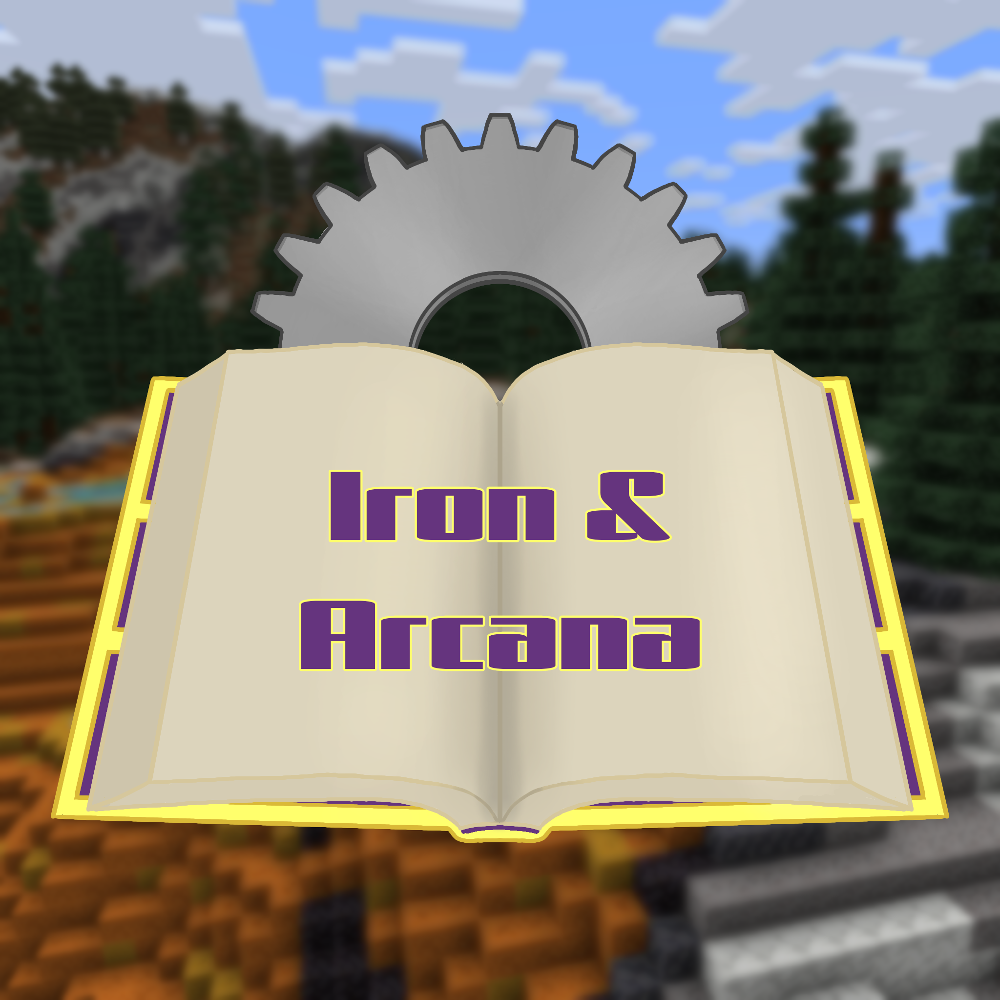

# Iron & Arcana

**Minecraft 1.20.1 · Forge 47.4.10 · 95 mods**

A colony-building, engineering and exploration pack for a small friend server.
Colonies and factories first, magic second, no automation shortcuts.

Not published on Modrinth or CurseForge — built and distributed from this
repository.

<br clear="right">

## The pack

| Pillar | Mods |
|---|---|
| Colony | MineColonies, Structurize, Domum Ornamentum, Stylecolonies, TownTalk |
| Engineering | Create + Crafts & Additions, Slice & Dice, Steam 'n' Rails |
| Industry | Immersive Engineering, Immersive Petroleum |
| Gear | Tinkers' Construct |
| Magic | Ars Nouveau (+ Ars Creo), Botania |
| Exploration | Twilight Forest, The Aether, Alex's Caves, Terralith, YUNG's structures |
| Seasons | Serene Seasons |

Design rules worth knowing before you play:

- **Tinkers' Construct is the only gear system.** Silent Gear was removed in 2.0.
- **One recipe viewer: EMI.** JEI is deliberately absent.
- **Automation shortcuts are disabled.** Sophisticated Backpacks is present, but
  every stack upgrade, both Infinity upgrades, and the feeding, inception,
  everlasting, auto-cooking and alchemy upgrades are turned off. Carrying more
  than one backpack applies Slowness.
- **No flight/airship mod.**

See [SKIPPED.md](SKIPPED.md) for what was considered and rejected, and why.

## Installing the client

1. Download `Iron & Arcana-<version>.mrpack` from
   [Releases](https://github.com/wrenchInTheWorks/iron-and-arcana/releases).
2. In the **Modrinth App** or **Prism Launcher**, create an instance *from file*
   and pick the `.mrpack`.
3. The launcher fetches Forge 47.4.10 and **Java 17** itself.

> Import as a **new instance** rather than over an old one. Reusing an instance
> can leave stale jars behind, which causes mod-mismatch kicks or launch crashes.

An `.mrpack` is a snapshot, so it goes stale whenever the pack changes. The
server self-updates from this repo on every restart; clients do not.

### Shaders (optional, not bundled)

Install **Oculus** alongside the pack — it works with Embeddium, which is
already included. Complementary Reimagined suits the pack's lighting best;
BSL and Sildur's Vibrant are good lighter alternatives.

## Running the server

Self-hosted with Docker. See **[server/README.md](server/README.md)** for setup,
updating, backups and the operational gotchas.

```bash
cd server
cp .env.example .env     # set WHITELIST, OPS, RCON_PASSWORD
docker compose up -d
```

The server installs the pack itself from this repo via `PACKWIZ_URL`, so
`docker compose restart` *is* the update.

## Repository layout

| Path | Purpose |
|---|---|
| `mods/*.pw.toml` | one packwiz metadata file per mod |
| `config/` | mod configs shipped with the pack — **edit here, not in the container** |
| `defaultconfigs/` | Forge server-scoped configs; seeds **new** worlds only |
| `server/` | Docker deployment |
| `docs/` | v1 mod inventory and historical notes |
| `CLAUDE.md` | maintainer handover — read this before changing the pack |

## Maintenance

```bash
packwiz refresh            # after any pack change
packwiz modrinth export    # catches mods that cannot be distributed
```

CI builds on every push and cuts a GitHub Release only when `pack.toml`'s
version changes.
